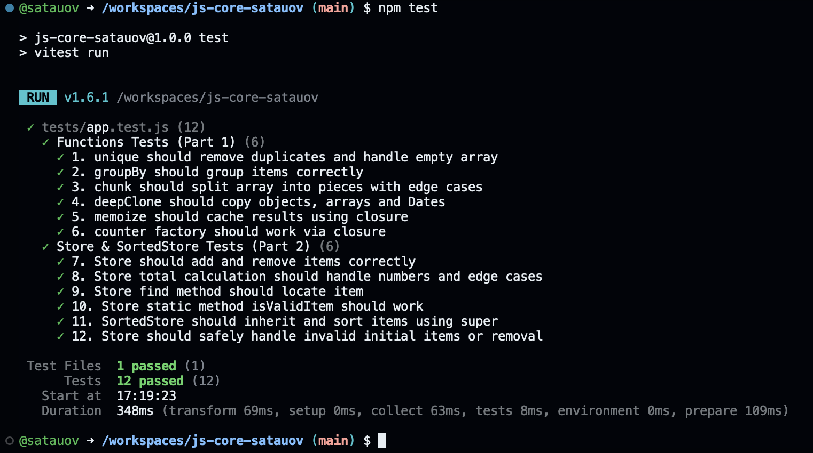

# Lab 4: JS Core

**Автор:** Максат Сатауов  
**Дисциплина:** JavaScript Core

---

## 1. How to Run Tests

To install dependencies and run the tests using **Vitest**, execute the following commands in the terminal:

### Install dependencies

```bash
npm install
```

### Run tests

```bash
npm test
```

> **Note:** To automatically re-run tests when files change, use:

```bash
npm run test:watch
```

---

## 2. Implemented Features

### Core Functions (`src/functions.js`)

| Function | Description |
|:---|:---|
| `unique(arr)` | Removes duplicate values from an array. Returns `[]` for invalid inputs. |
| `groupBy(arr, keyFn)` | Groups array elements by a dynamically calculated key. |
| `chunk(arr, size)` | Splits an array into smaller chunks of a specified size. |
| `deepClone(obj)` | Creates a deep copy of objects, arrays, and Date instances, safely cloning nested references. |
| `memoize(fn)` | Caches function execution results using closures. |
| `counter()` | Creates a counter factory with private, encapsulated state. |

### Classes (`src/Store.js`)

**`Store`**

Manages an array of products containing a name, price, and quantity.

Features:
- Private field `#items`.
- `add()` — adds a product.
- `remove()` — removes a product.
- `find()` — searches for a product.
- `total` — getter for the total value.
- `isValidItem()` — static method for product validation.

**`SortedStore`**

A child class that extends `Store`, overrides the product retrieval method, and uses `super` to access parent functionality.

---

## 3. Closures in My Code

A **closure** occurs when a function remembers and maintains access to variables from its lexical scope, even after the outer function has finished executing.

### 1. Closure in `counter()`

The variable `count` is declared inside the function. The returned methods (`inc`, `dec`, `value`) retain access to it.

This allows the counter to be modified and accessed while keeping its internal state protected from direct external modification.

### 2. Closure in `memoize(fn)`

A closure is used to preserve a cache (`Map`) between function calls.

The returned function accesses this cache and checks whether a result has already been stored before executing the original function `fn`.

This improves efficiency by avoiding unnecessary repeated calculations.

---

## 4. Test Results

The following screenshot demonstrates the results of the unit tests executed using **Vitest**.

<p align="center">
  
</p>

<p align="center">
  <em>Figure 1. Successful execution of the unit tests.</em>
</p>

---

## 5. Tools & References

- **MDN Web Docs** — Reference for closures, ES6 classes, private fields, and array methods.
- **Vitest Documentation** — Documentation for writing and running unit tests using `describe`, `it`, and `expect`.
- **Gemini AI** — Assistance with function architecture, deep cloning, and generating edge cases for testing.

---

<p align="center">
  <strong>Lab 4 — JavaScript Core</strong><br>
  <sub>Information Systems | IITU</sub>
</p>
